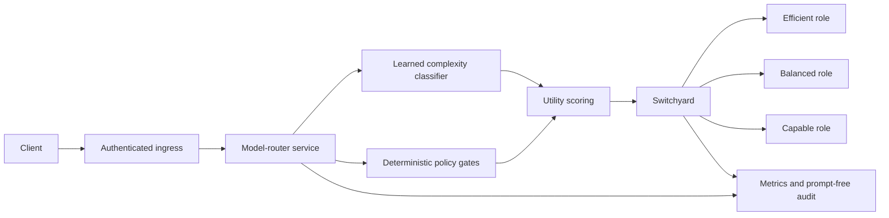

# Production-evaluation model router with NVIDIA NeMo Switchyard

This repository contains a trained, explainable LLM router and the controls needed to evaluate it safely on the path to production. It combines:

- a calibrated five-level request-complexity classifier;
- deterministic capability, risk, context, budget, and policy gates;
- quality/cost/latency utility scoring across stable model roles;
- [NVIDIA NeMo Switchyard](https://github.com/NVIDIA-NeMo/Switchyard) as the provider-facing protocol and routing gateway;
- offline, response-level, streaming-latency, and release-gate evaluation; and
- an authenticated shadow-mode HTTP service with prompt-free audit events and Prometheus metrics.

The project is ready for integration and shadow evaluation. It is **not approved for enforced production routing**. The supplied data labels prompt complexity but contains no candidate-model answers or real production outcomes, and the independent multi-turn slice exposes significant distribution shift.

Switchyard itself currently describes its upstream project as pre-alpha and explicitly not for production use. The architecture therefore keeps it behind a narrow adapter and requires a pinned build plus a separately tested direct-provider bypass before production enforcement.

## Current evidence

The selected classifier was trained on 86,967 audited examples using a deterministic normalized-prompt split:

| Split | Rows |
|---|---:|
| Train | 69,841 |
| Validation/calibration | 8,604 |
| Test | 8,522 |

| Evaluation | Exact accuracy | Tier under-route |
|---|---:|---:|
| Internal hash-held-out test | 90.93% | 3.64% |
| Genuinely non-overlapping multi-turn slice | 57.14% | 18.68% |

The multi-turn result is a release blocker. The internal result shows that the model learned the supplied synthetic rubric; it does not demonstrate production generalisation.

The current test suite contains 47 credential-free tests. Linting, formatting, source compilation, CLI operation, wheel packaging, catalogue validation, API behaviour, resilience, audit privacy, streaming parsing, evaluation resumability, and release gates are covered.

## Architecture



The learned model predicts complexity only. Deterministic policy remains responsible for:

- use case and risk;
- required tools, web access, or structured output;
- minimum model tier;
- model/provider allowlists;
- context and maximum output;
- request budget;
- latency SLA evidence;
- model health; and
- final quality/cost/latency ranking.

In `shadow` mode, the router records its proposed role but executes a fixed capable baseline. In `enforce` mode, it executes the proposed direct Switchyard target. The supplied deployment assets default to shadow mode.

## Initial model family

The versioned catalogue uses the current GPT-5.6 family as the first controlled candidate:

| Role | Provider model | Standard input / output per 1M tokens | Context | Max output |
|---|---|---:|---:|---:|
| `efficient` | `gpt-5.6-luna` | $1 / $6 | 1.05M | 128K |
| `balanced` | `gpt-5.6-terra` | $2.50 / $15 | 1.05M | 128K |
| `capable` | `gpt-5.6-sol` | $5 / $30 | 1.05M | 128K |

The cost engine includes cached-input rates, cache-write rates, and the published long-context multipliers above 272,000 input tokens. Every price records an official source URL and verification date.

Published model benchmarks are stored as directional research evidence. They are not treated as application success probabilities. Workload quality and p95 latency remain marked unmeasured; an explicit latency SLA fails closed until measured evidence is loaded.

See [model research](docs/model-research.md) for sources, benchmark context, and limitations.

## Quick start

Python 3.12 or newer is required.

```bash
python -m venv .venv
source .venv/bin/activate
python -m pip install -e '.[dev]'

ruff check .
ruff format --check .
python -m unittest discover -s tests -v
```

Route locally without calling a provider:

```bash
model-router route \
  "Design a multi-region payments service and compare consistency trade-offs" \
  --output-tokens 1500 \
  --complexity-policy conservative
```

Inspect the current production release gates:

```bash
model-router release-gates
```

This command currently exits with status 3 because enforcement is intentionally blocked. Its JSON output lists every passing and failing gate.

## CLI commands

| Command | Purpose | Calls a model? |
|---|---|---:|
| `route` | Return an explainable policy decision | No |
| `plan` | Map a decision to a Switchyard target/profile | No |
| `execute` | Route and execute through Switchyard | Yes |
| `switchyard-status` | Read Switchyard models or statistics | Gateway only |
| `benchmark` | Run the 12-case policy smoke test | No |
| `train` | Validate data, train, calibrate, and report | No |
| `live-eval` | Run frozen cases against direct model roles | Yes |
| `release-gates` | Evaluate production-enforcement evidence | No |

The CLI defaults to hybrid classification. Use `--classifier-mode heuristic` for the deterministic baseline or `--complexity-policy conservative` to reduce under-routing at higher expected cost.

Cost estimates can include `--cached-input-tokens` and `--cache-write-tokens`. Provider/model allowlists and measured-evidence requirements are available as hard constraints.

## HTTP service

The service exposes:

| Endpoint | Purpose |
|---|---|
| `GET /healthz` | Process liveness; does not depend on Switchyard |
| `GET /readyz` | Readiness including Switchyard health |
| `GET /metrics` | Prometheus text metrics |
| `POST /v1/route` | Explainable route only |
| `POST /v1/chat/completions` | OpenAI-compatible routed execution |

Start the dependency-free development server:

```bash
export MODEL_ROUTER_MODE=shadow
export MODEL_ROUTER_API_TOKEN="replace-me"
export SWITCHYARD_URL="http://127.0.0.1:4000"
model-router-api
```

Production containers use Gunicorn. API and metrics bearer tokens, the audit HMAC key, and gateway credentials must come from a secret manager. Prompts and responses are not written to the normal audit stream.

## Switchyard

### Current Rust server

`config/switchyard_routes.toml` follows the current native server schema. It defines:

- passthrough routes named `efficient`, `balanced`, and `capable`;
- capability-classifier experiments named `smart-general` and `smart-coding`;
- a quality-first stage route named `smart-agent-stage`; and
- a seeded random control named `benchmark-random`.

Build or install an explicitly approved Switchyard revision, then validate and run:

```bash
export OPENAI_API_KEY="replace-me"
switchyard-server --config config/switchyard_routes.toml --dry-run
switchyard-server --config config/switchyard_routes.toml \
  --host 127.0.0.1 \
  --port 4000
```

The provider credential belongs in Switchyard, not the custom router. The router should reach Switchyard over a private authenticated service boundary.

### Legacy Python package

`config/switchyard_profiles.yaml` remains only to reproduce the earlier `nemo-switchyard==0.1.0` prototype. New deployment work should use the current TOML configuration. `config/switchyard_stage_router_main.yaml` is also retained as historical preview material.

### Delegated routing safety

Switchyard classifier, stage, and random profiles are experimental comparison arms. Before delegation, the custom policy confirms that every model the profile could select satisfies the request's hard requirements. If any possible target violates budget, capability, context, latency-evidence, health, tier, or quality requirements, delegation is rejected.

The recommended application path remains custom `policy` routing to a direct Switchyard passthrough route.

## Training

The model is a weighted multinomial Naive Bayes classifier using stable hashed word unigrams, bigrams, and conversation-structure features. `borderline` examples receive reduced weight, and validation data calibrates the output probabilities.

Reproduce the selected artifact:

```bash
model-router train \
  /path/to/routing_dataset_100k_valid_only.jsonl \
  --external-context-dataset /path/to/routing_dataset_multiturn_with_models.jsonl
```

The command writes:

- `model_router/artifacts/complexity_router_v1.npz`;
- `reports/complexity_router_v1.json`; and
- `reports/complexity_router_v1.md`.

The equal-level dataset was trained as a challenger. It performed worse on the common internal and novel multi-turn sets; see `reports/experiments/champion_selection.md`.

## Evaluation

### Dataset and policy evaluation

Training reports accuracy, macro/weighted F1, ordinal errors, calibration, category/audit/turn slices, tier under-routing, cost proxies, classifier latency, and complete-policy simulation. These metrics measure agreement with complexity labels—not live answer quality.

The 12-case smoke benchmark verifies basic routing mechanics:

```bash
model-router benchmark --iterations 300
```

### Response-level benchmark

The live harness runs each frozen case against every specified direct target. It is concurrent, resumable, and supports repeated trials. By default it does not store response content.

```bash
model-router live-eval \
  examples/live_eval_cases.jsonl \
  --target efficient \
  --target balanced \
  --target capable \
  --concurrency 3 \
  --repetitions 3 \
  --stream
```

It records:

- call success and error type;
- response model and mismatch count;
- deterministic validator score;
- provider-reported input, cached-input, and output tokens;
- estimated actual cost from the versioned catalogue;
- total completion latency;
- streaming time to first token; and
- finish reason.

Supported validators are exact text, required substrings, regular expression, valid JSON, and required JSON keys. Open-ended reasoning, writing, and coding still require executable task outcomes, an approved independent judge rubric, blinded human review, or a combination.

## Resilience and observability

The Switchyard client includes timeouts, safe GET retries with exponential backoff and jitter, `Retry-After` handling, a circuit breaker, request IDs, and optional explicit fallback. Generation retries are off by default because a failed generation may still be billable.

Prometheus output covers decisions, estimated spend, execution outcomes, tokens, and latency histograms. Audit events include prompt HMAC, model/catalog/policy/classifier versions, decision, estimate, latency, usage, and error type without prompt or response content.

## Deployment

Deployment assets include:

- a non-root, read-only-root-filesystem-compatible `Dockerfile`;
- Gunicorn configuration;
- Kubernetes Deployment, Service, probes, resources, and secret references;
- a safe shadow-mode environment template;
- CI for linting, tests, package build, and container build; and
- a security policy.

See the [deployment and rollback runbook](docs/deployment-runbook.md) and [production-readiness design](docs/production-readiness.md).

## Enforced release gates

The default policy requires current pricing, workload-measured quality and latency, stronger external generalisation, a passing live benchmark for every role, an approved enforcement decision, a pinned Switchyard build, and a trusted direct-provider bypass.

Current expected failures are:

- enforcement mode has not been approved;
- quality and latency are not workload-measured;
- only 455 truly novel multi-turn examples are available and performance is below threshold;
- no paid live response benchmark has been run;
- the current Switchyard build has not been pinned and qualified; and
- a direct-provider bypass has not been configured.

These failures are intentional safety controls, not hidden TODOs.

## Project layout

```text
.
├── config/                 # catalogue release policy and Switchyard configs
├── deploy/                 # Gunicorn, environment, and Kubernetes assets
├── docs/                   # research, production readiness, and runbook
├── examples/               # frozen live cases and tool history
├── model_router/
│   ├── api.py              # shadow/enforce HTTP service
│   ├── artifacts/          # trained calibrated model
│   ├── audit.py            # prompt-free append-only audit events
│   ├── catalog.json        # provenance-aware model catalogue
│   ├── classifier.py       # learned and deterministic feature integration
│   ├── live_eval.py        # response, cost, TTFT, and validator harness
│   ├── observability.py    # Prometheus metrics
│   ├── readiness.py        # executable production release gates
│   ├── router.py           # eligibility and utility policy
│   ├── switchyard.py       # resilient gateway client and executor
│   └── training.py         # audit, split, train, calibrate, and report
├── reports/                # reproducible training and challenger evidence
└── tests/                  # credential-free unit and integration tests
```

## Primary references

- [NVIDIA NeMo Switchyard](https://github.com/NVIDIA-NeMo/Switchyard)
- [Switchyard routing overview](https://nvidia-nemo.github.io/Switchyard/routing_algorithms/overview/)
- [Switchyard LLM classifier](https://nvidia-nemo.github.io/Switchyard/routing_algorithms/llm_classifier_routing/)
- [Switchyard stage router](https://nvidia-nemo.github.io/Switchyard/routing_algorithms/stage_router_routing/)
- [OpenAI model catalogue](https://developers.openai.com/api/docs/models)
- [OpenAI API pricing](https://openai.com/api/pricing/)
- [GPT-5.6 published evaluations](https://openai.com/index/gpt-5-6/)
