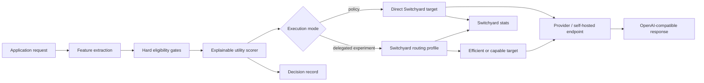

# Model-routing prototype with NVIDIA NeMo Switchyard

This project is a trained proof of concept for the model-routing proposal. It follows the recommended hybrid architecture:

- a small, explainable decision layer owns business policy, hard constraints, feature extraction, model eligibility, and quality/cost/latency scoring;
- [NVIDIA NeMo Switchyard](https://github.com/NVIDIA-NeMo/Switchyard) owns the execution boundary, OpenAI-compatible API, provider translation, profile-backed routing, context-overflow fallback, and runtime statistics;
- a calibrated learned classifier predicts audited Level 1–5 prompt complexity;
- evaluation harnesses compare the learned model, complete policy router, deterministic heuristic, and fixed-tier baselines.

The project is deliberately a prototype. Catalog prices, quality scores, and latency values are illustrative inputs until they are replaced with measurements for the exact deployed model versions.

## Current scope

Implemented:

- deterministic classification into general Q&A, coding, and reasoning;
- a trained five-level complexity classifier with a packaged artifact;
- deterministic 80/10/10 normalized-prompt hash splitting;
- audit-confidence weighting and probability calibration;
- learned, hybrid, and conservative complexity policies;
- heuristic request-complexity, risk, capability, and token estimates;
- learned minimum-tier enforcement behind hard business/technical gates;
- hard gates for health, context, capabilities, request budget, latency SLA, and minimum predicted quality;
- weighted ranking for balanced, cost, quality, and latency priorities;
- an auditable route decision with candidate scores and rejection reasons;
- a Switchyard HTTP adapter for `/v1/models`, `/v1/chat/completions`, and `/v1/stats`;
- safe direct execution through the policy-selected Switchyard target;
- optional delegation to Switchyard LLM-classifier, stage-router, and random-routing profiles;
- a dataset evaluation harness with confusion matrices, calibration, slice metrics, under-routing, tier-cost proxies, and end-to-end policy simulation;
- an offline 12-case policy smoke test;
- 31 unit tests that require no model credentials.

Not implemented yet:

- real model-quality measurements;
- live streaming;
- retries beyond those configured inside Switchyard;
- response validation and quality-driven escalation;
- persistent decision/response telemetry;
- tenant, residency, or data-classification policies;
- conversation affinity;
- production authentication, rate limiting, deployment, or dashboards.

## Architecture



The custom layer always runs first. In `policy` mode it makes the final model choice. In a delegated mode it acts as an admission-control layer: every target available to the selected Switchyard profile must pass the hard gates before Switchyard is allowed to choose between them. This prevents a semantic profile from bypassing a request budget, latency SLA, capability requirement, or quality floor.

## Project layout

```text
model-routing-prototype/
├── config/
│   ├── switchyard_profiles.yaml   # PyPI 0.1-compatible standalone config
│   └── switchyard_stage_router_main.yaml # main-branch stage preview
├── examples/
│   ├── live_eval_cases.jsonl      # example frozen response-level cases
│   └── tool_history.json          # agent history for stage-router smoke tests
├── reports/
│   ├── complexity_router_v1.md    # readable training/evaluation evidence
│   └── complexity_router_v1.json  # machine-readable full metrics and slices
├── model_router/
│   ├── artifacts/
│   │   └── complexity_router_v1.npz # trained and calibrated model
│   ├── benchmark.py               # offline policy comparison
│   ├── benchmark_cases.json       # hand-labelled minimum-tier cases
│   ├── catalog.json               # model roles, constraints, and priors
│   ├── catalog.py                 # catalog loader
│   ├── classifier.py              # heuristic and learned feature integration
│   ├── cli.py                     # route, plan, execute, train, status, benchmark
│   ├── evaluation.py              # classification, tier, cost, and calibration metrics
│   ├── learned.py                 # hashed vectorizer and trained model runtime
│   ├── live_eval.py               # response-level Switchyard benchmark runner
│   ├── router.py                  # hard gates and utility scorer
│   ├── switchyard.py              # gateway client and safe executor
│   ├── training.py                # data audit, training, calibration, and reports
│   └── types.py                   # routing contracts
└── tests/
    ├── test_learned.py
    ├── test_live_eval.py
    ├── test_router.py
    └── test_switchyard.py
```

## Quick start without credentials

Python 3.12 or newer is required because Switchyard 0.1 requires Python 3.12+.

From this directory:

```bash
python -m unittest discover -s tests -v

python -m model_router.cli route \
  "Design a multi-region payments service and compare consistency trade-offs" \
  --output-tokens 1500

python -m model_router.cli plan \
  "What is the capital of Japan?" \
  --mode policy \
  --output-tokens 50

python -m model_router.cli benchmark
```

`route`, `plan`, `benchmark`, and all unit tests are offline. They do not start Switchyard or call a model.

The CLI uses `hybrid` classification by default. Use `--classifier-mode heuristic` to run the original rules-only baseline, or `--complexity-policy conservative` to choose the 80th-percentile complexity level and reduce under-routing at higher expected cost.

## Learned complexity router

The packaged artifact is a weighted multinomial Naive Bayes classifier trained from 86,967 audited valid rows. It uses stable hashed word unigrams, bigrams, and conversation-structure features. `borderline` audit rows are retained at lower weight rather than treated as equally reliable ground truth.

The deterministic split contains:

- 69,841 training rows;
- 8,604 validation rows; and
- 8,522 test rows.

The validation split selects a probability-calibration temperature. The untouched test split is used once for the final internal metrics.

The learned model predicts complexity only. The custom router still applies use-case detection, capability requirements, risk, cost, latency, context, model health, and the final quality/cost/latency score. Complexity levels map to minimum model tiers as follows:

| Predicted level | Minimum role |
|---:|---|
| 1–2 | `efficient` |
| 3 | `balanced` |
| 4–5 | `capable` |

### Current evidence

On the 8,522-row hash-held-out test split:

- exact five-level accuracy is 90.93%;
- macro F1 is 0.909;
- collapsed-tier under-routing is 3.64%;
- the end-to-end hybrid policy has a 97.11% tier-success proxy and 35.19% illustrative cost saving versus always-capable.

On the 455 non-overlapping examples from the separate multi-turn file:

- exact accuracy falls to 57.14%; and
- collapsed-tier under-routing rises to 18.68%.

That distribution-shift result is a release blocker for using the artifact as the sole production selector. The artifact is appropriate for shadow-mode integration while a representative, response-level benchmark is built.

Read `reports/complexity_router_v1.md` for the concise report and `reports/complexity_router_v1.json` for all confusion matrices, category/audit-status slices, calibration metrics, and end-to-end results.

The equal-level dataset was also trained as a challenger. The full audited dataset remained better on the same 8,522 primary test rows and the same 455 truly novel multi-turn rows. See `reports/experiments/champion_selection.md` for the fair comparison and selection rationale.

## Reproduce training

The source datasets remain outside the package. Training records the dataset filename and SHA-256 in the artifact and report.

```bash
python -m model_router.cli train \
  /path/to/routing_dataset_100k_valid_only.jsonl \
  --external-context-dataset /path/to/routing_dataset_multiturn_with_models.jsonl
```

The command regenerates:

- `model_router/artifacts/complexity_router_v1.npz`;
- `reports/complexity_router_v1.json`; and
- `reports/complexity_router_v1.md`.

## Run Switchyard

Create an isolated environment and install this project with its Switchyard extra:

```bash
python -m venv .venv
source .venv/bin/activate
python -m pip install -e '.[switchyard]'
```

The supplied configuration uses the current standalone Switchyard structure: `endpoints`, `targets`, and `profiles`. It does not use the deprecated `routes`/`--routing-profiles` launcher bundle.

The example points at OpenRouter:

```bash
export OPENROUTER_API_KEY="replace-me"
switchyard serve --config config/switchyard_profiles.yaml --port 4000
```

Before making live calls, replace the example upstream models with approved models and update `model_router/catalog.json` to match their exact prices, context limits, capabilities, and measured performance. The role-to-target contract is:

| Policy role | Switchyard target | Purpose |
|---|---|---|
| `efficient` | `efficient` | routine, high-volume, latency/cost-sensitive work |
| `balanced` | `balanced` | mid-complexity default |
| `capable` | `capable` | complex, high-risk, or reasoning-heavy work |

Confirm that Switchyard exposes the targets and profiles:

```bash
python -m model_router.cli switchyard-status
python -m model_router.cli switchyard-status --stats
```

## Execute a request

The default mode uses the custom policy to choose a direct Switchyard target:

```bash
python -m model_router.cli execute \
  "Explain the difference between a process and a thread." \
  --mode policy \
  --output-tokens 300
```

The output includes both the pre-execution decision and Switchyard's OpenAI-compatible response.

The local proxy does not require a real bearer token in the default setup. If authentication is added in front of Switchyard, set `SWITCHYARD_API_KEY`. To use a different gateway address, set `SWITCHYARD_URL` or pass `--switchyard-url`.

## Routing modes

| CLI mode | Switchyard model/profile | Final choice | Intended use |
|---|---|---|---|
| `policy` | direct `efficient`, `balanced`, or `capable` target | custom router | default proof-of-concept path |
| `switchyard-general` | `smart-general` | Switchyard LLM classifier | mixed chat/API comparison |
| `switchyard-coding` | `smart-coding` | Switchyard LLM classifier | first-turn or non-agentic coding comparison |
| `switchyard-stage` | `smart-agent-stage` | Switchyard stage signals | main-branch preview; multi-turn coding agents with tool-result history |
| `switchyard-random` | `benchmark-random` | seeded 50/50 split | A/B and gateway baseline |

Example delegated classifier call:

```bash
python -m model_router.cli execute \
  "Plan and implement a multi-file API change with tests." \
  --mode switchyard-coding \
  --output-tokens 1200
```

### Stage-router release note

Switchyard's current `main` documentation describes `type: stage_router` for standalone profile configs, but the published `nemo-switchyard==0.1.0` package rejects that profile type. For that reason, the default `switchyard_profiles.yaml` is compatible with the published package and excludes the stage profile. `config/switchyard_stage_router_main.yaml` contains the documented main-branch preview separately.

When using a Switchyard source build that includes the standalone stage profile, start that configuration:

```bash
switchyard serve \
  --config config/switchyard_stage_router_main.yaml \
  --port 4000
```

Then plan or execute a stage-router call using prior tool history:

```bash
python -m model_router.cli plan \
  "Now implement the validation and run the tests." \
  --messages-file examples/tool_history.json \
  --mode switchyard-stage \
  --use-case coding \
  --output-tokens 900
```

The stage-router mode is intentionally rejected when there is no `role: tool` history. Switchyard derives agent stage from tool results; it is not a useful semantic router for plain single-turn chat.

## Switchyard profiles in this prototype

`smart-general` and `smart-coding` use Switchyard's `llm-routing` profile. A classifier assigns the request to a weak or strong tier. The configuration sets:

- `classifier_min_confidence: 0.6`;
- fail-open behavior to the profile default tier;
- a four-turn recent context window;
- the capable target as context-overflow fallback.

The preview `smart-agent-stage` configuration uses Switchyard's stage router with:

- `picker: capable_first` as the quality-first default;
- an explicit `confidence_threshold: 0.5`;
- a three-turn signal window;
- no per-turn LLM classifier, avoiding an extra classifier call for agent steps.

`benchmark-random` uses a seeded 50/50 split. It is not an intelligent router; it provides a control arm for model-pair and gateway measurements.

## Safety behavior

Delegated profiles can only choose between `efficient` and `capable`. Before using one, the custom router checks both candidates. Delegation fails closed if either model:

- exceeds the request cost cap or latency SLA;
- lacks a required capability;
- is unhealthy or disabled;
- cannot fit the expected context;
- falls below the request's predicted quality floor.

This is intentionally stricter than selecting the best remaining model. A two-target profile must not be used if one of its possible outcomes violates a hard request requirement; `policy` mode remains available because it sends directly to an eligible target.

## Offline benchmarks

### Dataset evaluation

The training command is also the main dataset evaluation harness. It compares:

- learned argmax;
- learned expected-level rounding;
- learned conservative p80;
- deterministic heuristic;
- majority-level;
- always-efficient;
- always-balanced; and
- always-capable.

It separately simulates the complete router so that model-catalogue quality gates and utility scoring are reflected in the route mix and cost estimate.

These metrics evaluate agreement with synthetic complexity labels. They do not evaluate actual candidate-model answers.

### Twelve-case smoke test

```bash
python -m model_router.cli benchmark --iterations 300
```

The benchmark currently checks whether the selected tier meets a hand-labelled minimum tier for 12 representative requests. It reports:

- proxy pass rate;
- estimated cost;
- illustrative latency prior;
- overqualification rate;
- route distribution;
- cost saving versus always-capable;
- local router overhead.

This is a policy smoke test, not a model-quality benchmark. The next evaluation stage must execute every candidate model against a frozen representative dataset and replace minimum-tier labels with executable tests, blinded preference judgements, groundedness checks, or task-specific scores.

### Response-level Switchyard harness

`live-eval` runs every frozen case against every requested direct Switchyard target. It captures call success, actual token usage, completion latency, validator results, and response model. It is concurrent and resumable; response content is omitted unless `--store-content` is explicitly supplied.

```bash
python -m model_router.cli live-eval \
  examples/live_eval_cases.jsonl \
  --target efficient \
  --target balanced \
  --target capable \
  --concurrency 3
```

Supported deterministic validators are:

- exact text match;
- required substrings;
- regular expressions;
- valid JSON; and
- required JSON keys.

The default outputs are `reports/live_eval_results.jsonl` and `reports/live_eval_summary.json`. Open-ended reasoning, writing, and coding cases still require executable task tests, an approved judge rubric, blinded human review, or a combination of these. The attached complexity dataset has no candidate responses or reference outcomes, so no honest response-quality benchmark can be generated from it alone.

## Recommended next implementation slices

1. Replace the example catalog and Switchyard targets with the approved model set.
2. Build a representative production-distribution dataset rather than using only synthetic rubric-generated prompts.
3. Add a response-level evaluation runner that calls every direct Switchyard target for every frozen case.
4. Persist actual input/output tokens, time to first token, completion latency, errors, target/profile, and task score.
5. Add response validators and one controlled escalation from efficient/balanced to capable.
6. Add policy versioning and a stable decision event schema.
7. Compare `policy`, Switchyard classifier, Switchyard stage-router, random, and fixed-model baselines on the same cases.
8. Run shadow mode and measure drift before allowing automatic selection on production traffic.

## References

- [NVIDIA NeMo Switchyard](https://github.com/NVIDIA-NeMo/Switchyard)
- [Switchyard routing overview](https://github.com/NVIDIA-NeMo/Switchyard/blob/main/docs/routing_algorithms/overview.md)
- [Switchyard LLM-classifier routing](https://github.com/NVIDIA-NeMo/Switchyard/blob/main/docs/routing_algorithms/llm_classifier_routing.md)
- [Switchyard stage-router routing](https://github.com/NVIDIA-NeMo/Switchyard/blob/main/docs/routing_algorithms/stage_router_routing.md)
- [Switchyard random routing](https://github.com/NVIDIA-NeMo/Switchyard/blob/main/docs/routing_algorithms/random_routing.md)
