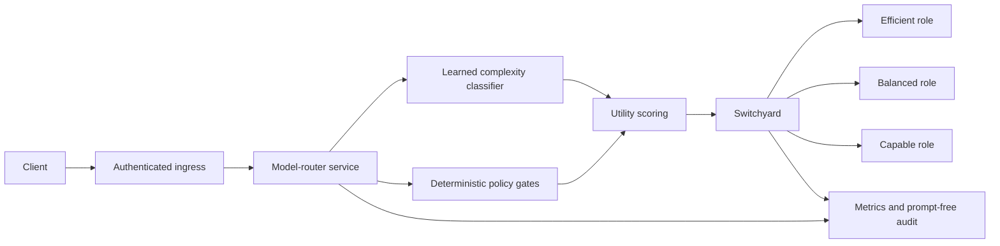

# Production-evaluation model router with NVIDIA NeMo Switchyard

This repository contains a trained, explainable LLM router and the controls needed to evaluate it safely on the path to production. It combines:

- a calibrated multi-view, five-level request-complexity classifier;
- deterministic capability, risk, context, budget, and policy gates;
- quality/cost/latency utility scoring across stable model roles;
- [NVIDIA NeMo Switchyard](https://github.com/NVIDIA-NeMo/Switchyard) as the provider-facing protocol and routing gateway;
- offline, response-level, streaming-latency, and release-gate evaluation; and
- an authenticated shadow-mode HTTP service with prompt-free audit events,
  drift detection, Prometheus metrics, and fail-closed enforcement.

The project is ready for integration and shadow evaluation. It is **not approved for enforced production routing**. The supplied data labels prompt complexity but contains no candidate-model answers or real production outcomes, and the independent multi-turn slice exposes significant distribution shift.

Switchyard is treated as an approved gateway dependency. The project pins release
`v0.2.0` and immutable source commit
`1fc9ab887d1c663b0048ae24d5f473d15ed8daaa`, validates the native server and
route contract in CI, and provides a pinned gateway image and Kubernetes service.
The narrow adapter and separately tested direct-provider recovery path remain
defence-in-depth controls rather than statements about Switchyard maturity.

## Current evidence

The selected classifier was trained on 86,967 audited examples using a deterministic normalized-prompt split:

| Split | Rows |
|---|---:|
| Train | 69,841 |
| Validation/calibration | 8,604 |
| Test | 8,522 |

| Evaluation | Exact accuracy | Tier under-route |
|---|---:|---:|
| Internal hash-held-out test | 91.95% | 2.79% |
| Genuinely non-overlapping multi-turn slice | 59.12% | 17.36% |

The multi-turn result is a release blocker. The internal result shows that the model learned the supplied synthetic rubric; it does not demonstrate production generalisation.

The selected model combines complete-conversation and final-turn predictions with
a validation-selected 0.05 final-turn weight and temperature 4.362. Training-only
prompt-envelope augmentation improves robustness without changing validation, test,
or external prompts. The adaptive policy now treats disagreement between the full
conversation and final-user-turn tiers as uncertainty and applies posterior-risk
escalation. End-to-end tier under-routing is 1.26% internally and 10.99% on the
455-prompt multi-turn diagnostic, compared with 2.03% and 14.95% before the guard.
Its estimated internal cost is 34.45% below the newly repriced always-capable
reference. These are offline proxies, not measured production savings.

Classifier-only latency on this development machine was 116 µs median, 166 µs p95,
and 191 µs p99 over 1,000 prompts. This is recorded for regression purposes and
does not include Switchyard, network, or model-generation time.

The current test suite contains 83 credential-free tests. Linting, formatting,
source compilation, CLI operation, wheel packaging, catalogue validation, API
behaviour, resilience, audit privacy, drift detection, streaming parsing,
evaluation resumability, adversarial regression, and release gates are covered.

## Architecture



The learned model predicts complexity only. Deterministic policy remains responsible for:

- use case and risk;
- required tools, web access, or structured output;
- minimum model tier;
- model/provider allowlists;
- context and maximum output;
- request budget;
- latency SLA evidence;
- model health; and
- final quality/cost/latency ranking.

In `shadow` mode, the router records its proposed role but executes a fixed capable
baseline. In `enforce` mode, it executes the proposed direct Switchyard target.
Enforcement now refuses to start unless every configured release gate passes. The
supplied deployment assets default to shadow mode.

## Initial model family

The versioned catalogue uses the current GPT-5.6 family as the first controlled candidate:

| Role | Provider model | Standard input / output per 1M tokens | Context | Max output |
|---|---|---:|---:|---:|
| `efficient` | `gpt-5.6-luna` | $0.20 / $1.20 | 1.05M | 128K |
| `balanced` | `gpt-5.6-terra` | $2 / $12 | 1.05M | 128K |
| `capable` | `gpt-5.6-sol` | $4 / $20 | 1.05M | 128K |

The cost engine includes cached-input rates, cache-write rates, and the published long-context multipliers above 272,000 input tokens. Every price records an official source URL and verification date. `model-router verify-pricing` independently downloads the official model Markdown, compares every billable field and limit, and writes a digest-bound verification report; enforcement rejects stale reports or reports created for another catalogue revision.

Published model benchmarks are stored as directional research evidence. They are not treated as application success probabilities. Workload quality and p95 latency remain marked unmeasured; an explicit latency SLA fails closed until measured evidence is loaded.

See [model research](docs/model-research.md) for sources, benchmark context, and limitations.

## Quick start

Python 3.12 or newer is required.

```bash
python -m venv .venv
source .venv/bin/activate
python -m pip install -e '.[dev]'

ruff check .
ruff format --check .
python -m unittest discover -s tests -v
```

Route locally without calling a provider:

```bash
model-router route \
  "Design a multi-region payments service and compare consistency trade-offs" \
  --output-tokens 1500 \
  --complexity-policy conservative
```

Inspect the current production release gates:

```bash
model-router release-gates
```

This command currently exits with status 3 because enforcement is intentionally blocked. Its JSON output lists every passing and failing gate.

Run the deterministic design regression suite:

```bash
model-router adversarial-eval
model-router metamorphic-eval
```

## CLI commands

| Command | Purpose | Calls a model? |
|---|---|---:|
| `route` | Return an explainable policy decision | No |
| `plan` | Map a decision to a Switchyard target/profile | No |
| `execute` | Route and execute through Switchyard | Yes |
| `switchyard-status` | Read Switchyard models or statistics | Gateway only |
| `benchmark` | Run the 12-case policy smoke test | No |
| `train` | Validate data, train, calibrate, and report | No |
| `live-eval` | Run frozen cases against direct model roles | Yes |
| `case-set-hash` | Compute the immutable live case-set digest | No |
| `workload-evidence` | Create a prompt-free quality/latency approval artifact | No |
| `release-gates` | Evaluate production-enforcement evidence | No |
| `live-policy-comparison` | Compare routed outcomes with fixed-model live arms | No new calls |
| `verify-pricing` | Verify catalogue economics against official model pages | Provider docs only |
| `adversarial-eval` | Run 179 deterministic routing regression cases | No |
| `metamorphic-eval` | Run 1,432 meaning-preserving routing invariance cases | No |
| `drift-baseline` | Create an approved baseline from prompt-free audit events | No |
| `drift-report` | Compare recent audit events with the approved baseline | No |

The CLI defaults to hybrid classification with the adaptive policy. Adaptive mode
uses ordinary argmax routing for confident, normal-risk work and posterior tier-risk
routing for high-risk, quality-first, low-confidence, or cross-view-disagreement
work. Use
`--classifier-mode heuristic` for the deterministic baseline or
`--complexity-policy tier_risk` for a stronger under-routing bound at higher cost.
The adaptive confidence threshold is configurable. Training evaluates 28 threshold
and posterior-risk combinations using only the validation split, then checks the
frozen candidate on held-out and external data. The latest cheaper candidate was
not promoted because it worsened external multi-turn under-routing.

Cost estimates can include `--cached-input-tokens` and `--cache-write-tokens`. Provider/model allowlists and measured-evidence requirements are available as hard constraints.

## HTTP service

The service exposes:

| Endpoint | Purpose |
|---|---|
| `GET /healthz` | Process liveness; does not depend on Switchyard |
| `GET /readyz` | Readiness including Switchyard and enforcement-gate state |
| `GET /metrics` | Prometheus text metrics |
| `POST /v1/route` | Explainable route only |
| `POST /v1/chat/completions` | OpenAI-compatible routed execution |

Start the dependency-free development server:

```bash
export MODEL_ROUTER_MODE=shadow
export MODEL_ROUTER_API_TOKEN="replace-me"
export SWITCHYARD_URL="http://127.0.0.1:4000"
model-router-api
```

Production containers use Gunicorn. API and metrics bearer tokens, the audit HMAC key, and gateway credentials must come from a secret manager. Prompts and responses are not written to the normal audit stream.

## Switchyard

### Current Rust server

`config/switchyard_routes.toml` follows the pinned v0.2.0 native server schema. It defines:

- passthrough routes named `efficient`, `balanced`, and `capable`;
- capability-classifier experiments named `smart-general` and `smart-coding`;
- a quality-first stage route named `smart-agent-stage`; and
- a seeded random control named `benchmark-random`.

Install the pinned package and validate the exact runtime/configuration contract:

```bash
python -m pip install -e '.[switchyard]'
export OPENAI_API_KEY="replace-me"
python -m model_router.switchyard_contract \
  --output reports/switchyard_contract.json
```

Build and run the separately deployable native server image:

```bash
docker build -f Dockerfile.switchyard -t model-router-switchyard:v0.2.0 .
docker run --rm -p 4000:4000 \
  -e OPENAI_API_KEY \
  model-router-switchyard:v0.2.0
```

For a source installation of the official Rust binary:

```bash
switchyard-server --config config/switchyard_routes.toml --dry-run
switchyard-server --config config/switchyard_routes.toml \
  --host 127.0.0.1 \
  --port 4000
```

The provider credential belongs in Switchyard, not the custom router. The router should reach Switchyard over a private authenticated service boundary.

### Legacy Python package

`config/switchyard_profiles.yaml` remains only to reproduce the earlier `nemo-switchyard==0.1.0` prototype. New deployment work should use the current TOML configuration. `config/switchyard_stage_router_main.yaml` is also retained as historical preview material.

### Delegated routing safety

Switchyard classifier, stage, and random profiles are experimental comparison arms. Before delegation, the custom policy confirms that every model the profile could select satisfies the request's hard requirements. If any possible target violates budget, capability, context, latency-evidence, health, tier, or quality requirements, delegation is rejected.

The recommended application path remains custom `policy` routing to a direct Switchyard passthrough route.

## Training

The model is a weighted multinomial Naive Bayes classifier using stable hashed word
unigrams, bigrams, and conversation-structure features. `borderline` examples
receive reduced weight. Validation data, rather than the test split, selects the
full-conversation/final-turn ensemble weight and probability temperature. The same
validation split selects a candidate adaptive escalation policy under a predeclared
tier-risk cap; external confirmation is required before adoption. Each train-split
prompt receives two deterministic, half-weight prompt-envelope augmentations. No
validation, test, or external prompt is augmented, preventing split leakage.

Reproduce the selected artifact:

```bash
model-router train \
  /path/to/routing_dataset_100k_valid_only.jsonl \
  --external-context-dataset /path/to/routing_dataset_multiturn_with_models.jsonl
```

The command writes:

- `model_router/artifacts/complexity_router_v3.npz`;
- `reports/complexity_router_v3.json`; and
- `reports/complexity_router_v3.md`.

The previous models and equal-level dataset remain challengers. The datagen
re-audit, rejected soft-label experiment, augmentation grid, and v3 promotion are
documented in `reports/experiments/datagen_reaudit_v3.md`.

Generate a privacy-safe structural audit of the private datagen folder without
emitting prompt text:

```bash
model-router dataset-audit /path/to/model-routing-datagen
```

## Evaluation

### Dataset and policy evaluation

Training reports accuracy, macro/weighted F1, ordinal errors, calibration, category/audit/turn slices, tier under-routing, cost proxies, classifier latency, and complete-policy simulation. These metrics measure agreement with complexity labels—not live answer quality.

The 12-case smoke benchmark verifies basic routing mechanics:

```bash
model-router benchmark --iterations 300
```

The separate adversarial suite is deterministic and never enters training or the
independent release gate. It exposed keyword-driven over-routing and multi-turn
task-switch failures. The expanded v3 default has 1.68% under-routing across 179
cases, and all concise-hard/high-stakes cases remain on the capable tier. See
`reports/experiments/adversarial_regression_v1.md` and
`reports/experiments/multi_view_disagreement_v1.md`.

The metamorphic suite applies eight meaning-preserving presentation changes to all
179 adversarial cases. All eight exact, versioned application-envelope contracts
are normalized before semantic classification while raw tokens remain available
for cost estimation. On the promoted default policy, tier and model invariance are
100%, tier under-routing is 1.68%, and exact tier accuracy is 75.42%. These
synthetic metrics are a regression gate, never a
substitute for real workload outcomes.

### Response-level benchmark

The live harness runs each frozen case against every specified direct target. It is concurrent, resumable, and supports repeated trials. By default it does not store response content.

`examples/live_eval_cases.jsonl` now contains 120 generated, machine-checkable
baseline cases across arithmetic, structured extraction, string handling, logic,
and code comprehension. Its canonical digest is
`bff04cf245b2a441bf83560cdaea41765d656e538f1b1b0ba9b922ac65a0a311`.
The digest is deliberately not approved in the release policy: this set proves the
harness and supplies repeatable latency/cost measurements, but it must be extended
with privacy-reviewed real workloads before production approval.

```bash
model-router live-eval \
  examples/live_eval_cases.jsonl \
  --target efficient \
  --target balanced \
  --target capable \
  --concurrency 3 \
  --repetitions 3 \
  --switchyard-revision 1fc9ab887d1c663b0048ae24d5f473d15ed8daaa \
  --stream
```

It records:

- call success and error type;
- response model and mismatch count;
- deterministic validator score;
- provider-reported input, cached-input, and output tokens;
- estimated actual cost from the versioned catalogue;
- total completion latency;
- streaming time to first token; and
- finish reason;
- p50/p95/p99 latency and TTFT;
- end-to-end and generation output-token throughput;
- Wilson 95% intervals for call success and validator pass rates;
- per-category, use-case, risk, and complexity slices; and
- prompt-free case-set coverage, including unique cases, validator types, sources,
  and metadata distributions.

Compute and approve the frozen case digest before spending on a live run:

```bash
model-router case-set-hash examples/live_eval_cases.jsonl
```

The summary is cryptographically bound to the exact canonical case set, catalogue,
targets, repetition count, streaming mode, and content-retention setting. Resume is
refused when any of those inputs or the Switchyard revision changed. Enforcement
additionally requires the case-set digest to be explicitly approved in
`config/release_policy.json` and the run to use the approved Switchyard revision.
Repeated trials quantify nondeterminism, but they cannot inflate release coverage:
the default gate requires 100 distinct cases per role, including at least 20 distinct
cases and an 85% validator pass rate in each of general Q&A, coding, and reasoning,
plus a measured p95 completion latency.

After the live summary is complete, create a public-safe aggregate approval artifact:

```bash
model-router workload-evidence \
  --live-summary reports/live_eval_summary.json \
  --output reports/workload_evidence.json
shasum -a 256 reports/workload_evidence.json
```

The artifact contains role identities, unique-case counts, quality rates and
confidence intervals, latency distributions, cost totals, and source digests—but no
prompts or responses. Review it, then place its exact digest in
`approved_workload_evidence_sha256`. Enforcement validates that digest against the
unchanged live summary and catalogue, then overlays the approved per-use-case quality
and p95 latency measurements at startup. This avoids changing the base catalogue and
invalidating the benchmark that produced the measurements.

Because every case is run against every role, the same paid responses can then test
the router policy with that measured overlay and without another provider call:

```bash
model-router live-policy-comparison examples/live_eval_cases.jsonl \
  --results reports/live_eval_results.jsonl \
  --live-summary reports/live_eval_summary.json \
  --workload-evidence reports/workload_evidence.json \
  --output reports/live_policy_comparison.json
shasum -a 256 reports/live_policy_comparison.json
```

This paired replay compares the selected role with always-efficient,
always-balanced, and always-capable arms. It reports end-to-end validator quality,
cost, latency, routing mix, avoidable failures where another role succeeded, and
cost regret against the cheapest passing role. It contains no prompts or responses
and is bound to the exact case set, result file, live summary, workload overlay,
catalogue, router artifact, and policy version. The initial gate requires at least
98% of the capable arm's quality, at least 15% cost savings, and no more than 2%
avoidable validator failures; owners must approve those business thresholds and the
exact report digest.

For the first enforced release, the approved comparison covers only the `balanced`
request priority. Enforcement therefore rejects `cost`, `quality`, or `latency`
priority overrides until each is represented by an approved comparison. It also
refuses startup if the runtime classifier mode, decision policy, under-route
tolerance, or confidence threshold differs from the benchmarked configuration.

Supported validators are exact text, required substrings, regular expression,
valid JSON, required JSON keys, exact JSON values, and numeric tolerance. Open-ended
reasoning, writing, and coding still require executable task outcomes, an approved
independent judge rubric, blinded human review, or a combination.

## Resilience and observability

The Switchyard client includes timeouts, safe GET retries with exponential backoff and jitter, `Retry-After` handling, a circuit breaker, request IDs, and optional explicit fallback. Generation retries are off by default because a failed generation may still be billable.

Prometheus output covers decisions, estimated spend, execution outcomes, tokens,
latency histograms, classifier confidence, normalized entropy, posterior tier
risk, and full-conversation/final-turn tier disagreement. Audit events include the
same structured disagreement evidence plus prompt HMAC, model/catalog/policy/
classifier versions, decision, estimate, latency, usage, and error type without
prompt or response content.

After an approved shadow window, create and retain an immutable drift baseline,
then compare each subsequent observation window:

```bash
model-router drift-baseline audit-shadow.jsonl --output config/drift_baseline.json
model-router drift-report audit-current.jsonl --baseline config/drift_baseline.json
```

The report uses Jensen-Shannon distance for categorical distributions and
standardized mean shifts for uncertainty and cost. It exits non-zero for material
drift or insufficient data.

## Deployment

Deployment assets include:

- a non-root, read-only-root-filesystem-compatible `Dockerfile`;
- Gunicorn configuration;
- Kubernetes Deployment, Service, probes, resources, and secret references;
- a safe shadow-mode environment template;
- CI for linting, tests, package build, and container build; and
- a security policy.

See the [deployment and rollback runbook](docs/deployment-runbook.md) and [production-readiness design](docs/production-readiness.md).

## Enforced release gates

The default policy requires current provider-verified pricing, evidence bound to the
exact catalogue and router artifact, workload-measured quality and latency, stronger
external generalisation, a passing immutable live benchmark for every role, an
approved case-set digest and enforcement decision, a passing metamorphic regression,
the pinned Switchyard runtime/configuration contract, and a trusted direct-provider
bypass.

Current expected failures are:

- enforcement mode has not been approved;
- quality and latency are not workload-measured;
- only 455 related synthetic multi-turn examples are novel, performance is below
  threshold, and the aggregate independence evidence is deliberately unapproved;
- no paid live response benchmark has been run;
- no live case-set digest has been approved;
- a direct-provider bypass has not been configured.

These failures are intentional safety controls, not hidden TODOs.

## Project layout

```text
.
├── config/                 # catalogue release policy and Switchyard configs
├── deploy/                 # Gunicorn, environment, and Kubernetes assets
├── docs/                   # research, production readiness, and runbook
├── examples/               # frozen live cases and tool history
├── model_router/
│   ├── api.py              # shadow/enforce HTTP service
│   ├── artifacts/          # trained calibrated model
│   ├── audit.py            # prompt-free append-only audit events
│   ├── catalog.json        # provenance-aware model catalogue
│   ├── classifier.py       # learned and deterministic feature integration
│   ├── drift.py            # prompt-free distribution-drift reports
│   ├── live_eval.py        # response, cost, TTFT, and validator harness
│   ├── metamorphic.py      # prompt-envelope invariance regression
│   ├── normalization.py    # exact supported envelope contracts
│   ├── observability.py    # Prometheus metrics
│   ├── pricing.py          # official-source catalogue verifier
│   ├── readiness.py        # executable production release gates
│   ├── router.py           # eligibility and utility policy
│   ├── switchyard.py       # resilient gateway client and executor
│   ├── switchyard_contract.py # pinned native runtime/config check
│   └── training.py         # audit, split, train, calibrate, and report
├── reports/                # reproducible training and challenger evidence
└── tests/                  # credential-free unit and integration tests
```

## Primary references

- [NVIDIA NeMo Switchyard](https://github.com/NVIDIA-NeMo/Switchyard)
- [Switchyard routing overview](https://nvidia-nemo.github.io/Switchyard/routing_algorithms/overview/)
- [Switchyard LLM classifier](https://nvidia-nemo.github.io/Switchyard/routing_algorithms/llm_classifier_routing/)
- [Switchyard stage router](https://nvidia-nemo.github.io/Switchyard/routing_algorithms/stage_router_routing/)
- [OpenAI model catalogue](https://developers.openai.com/api/docs/models)
- [OpenAI API pricing](https://openai.com/api/pricing/)
- [GPT-5.6 published evaluations](https://openai.com/index/gpt-5-6/)
- [OpenAI: choosing the right model](https://developers.openai.com/tracks/building-agents#how-to-choose)
