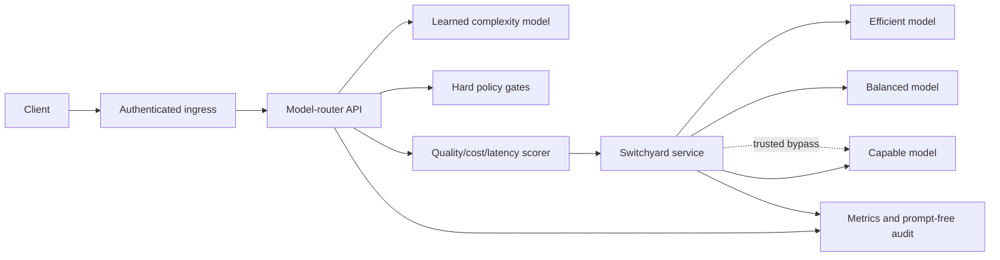

# Production-readiness design

## Current position

The repository is deployable for integration and shadow-mode evaluation. It is intentionally blocked from enforced production routing.

Run:

```bash
model-router release-gates
```

The command exits successfully only when every release condition passes. The current report is expected to fail because live model outcomes and production-distribution evidence have not been supplied.

## Runtime architecture



The custom service owns decisions and business controls. Switchyard owns the provider-facing protocol boundary. This separation is especially important because Switchyard is currently pre-alpha: its failure or upgrade must not require rewriting the learned router.

## Implemented safeguards

### Safe rollout modes

- `shadow`: records the proposed route but executes a fixed capable baseline.
- `enforce`: executes the selected target and is intended only after release gates pass.

The container and Kubernetes examples default to `shadow`.

### Hard eligibility controls

Models can be rejected for tier, capability, context, maximum output, health, request budget, provider allowlist, model allowlist, latency SLA, or predicted-quality floor. Explicit latency SLAs are rejected while latency evidence is marked unmeasured.

### Evidence-aware catalogue

The catalogue records provider and upstream model, verified price source and date, cache pricing, long-context multipliers, context/output limits, and evidence status for quality and latency. Published vendor benchmarks are stored separately from workload-measured scores.

### Dependency resilience

- connect/read timeout at the HTTP boundary;
- bounded exponential backoff with jitter for safe/idempotent requests;
- `Retry-After` handling;
- circuit breaker with a recovery probe;
- no automatic generation retry by default, avoiding silent duplicate billing;
- optional cross-target fallback with an explicit audit trail; and
- Switchyard liveness/readiness checks.

### Data minimisation

The normal audit trail stores request ID, tenant ID, prompt HMAC, policy/catalog/model versions, classification, decision, estimated cost, tokens, latency, and outcome. It never stores prompt text. Response content is also omitted. A secret HMAC key prevents practical dictionary matching of prompt fingerprints.

### Observability

The API exports bounded-cardinality Prometheus metrics for:

- route counts by model, use case, and classifier;
- estimated spend by selected role;
- execution success/error counts;
- provider-reported input/output tokens; and
- completion-latency histograms.

Switchyard's own `/v1/stats`, selected-model headers, and provider telemetry should be collected alongside these metrics.

## Release gates

The default release policy requires:

1. an explicit change from shadow to enforce mode;
2. current, source-linked pricing;
3. workload-measured response quality for every role;
4. workload-measured latency for every role;
5. at least 1,000 independent external examples, at least 75% exact complexity accuracy, and no more than 5% tier under-routing;
6. at least 100 live response cases per role with at least a 90% all-validator pass rate;
7. a pinned and tested Switchyard release or commit; and
8. a trusted direct-provider bypass.

Thresholds are initial release criteria and must be approved against business risk. Open-ended work also needs blinded human review or an approved judge model; deterministic validators alone are insufficient.

## Remaining production work

### Evidence and calibration

- Collect a privacy-reviewed sample of real intended traffic.
- Create frozen train, calibration, test, and out-of-distribution sets by customer or time boundary—not random row split alone.
- Run all three models on every eligible response-level case.
- Measure quality, TTFT, completion latency, output rate, tokens, price, errors, and refusal rate by slice.
- Replace every `heuristic_prior_pending_workload_eval` and `unmeasured_bootstrap_prior` marker only after the underlying report is reviewed and versioned.
- Retrain or recalibrate the complexity model because the current novel multi-turn result is below the release threshold.

### Platform and security

- Put OAuth/JWT or service identity, tenant quotas, and rate limiting at the ingress layer.
- Use a managed secret store and automated rotation.
- Confirm provider retention, training, residency, and zero-data-retention terms.
- Add prompt-injection and content-safety controls appropriate to the application.
- Send audit records to immutable central storage with retention and access controls.
- Perform threat modelling, dependency scanning, SBOM generation, image signing, and penetration testing.

### Reliability

- Pin and fault-test Switchyard; its upstream project currently warns against production use.
- Implement and exercise a direct-provider bypass independently of Switchyard.
- Load-test the entire path at expected peak concurrency.
- Define SLOs and alerts for success, p95/p99 latency, under-routing, fallback, cost, token use, and distribution drift.
- Add multi-region or multi-provider failover if required by the availability target.
- Test graceful shutdown, rolling upgrades, rollback, quota exhaustion, 429s, slow responses, invalid JSON, and partial streams.

### Governance

- Assign owners for the routing policy, catalogue, training data, model artifact, Switchyard build, and release approval.
- Version every decision input and retain reproducible reports.
- Establish model/provider deprecation procedures and emergency kill switches.
- Review high-risk use cases separately; the generic complexity model is not a domain safety system.

## Acceptance statement

Passing unit tests or the synthetic complexity benchmark is not production approval. Enforced routing is approved only when the executable release-gate report, live response evidence, security review, load test, operational runbook, and rollback exercise all pass for the exact immutable artifact and deployment configuration.
